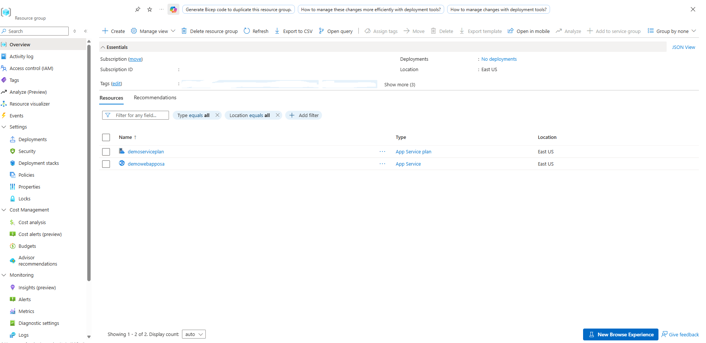
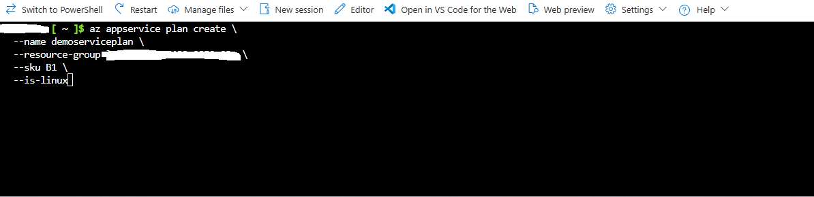
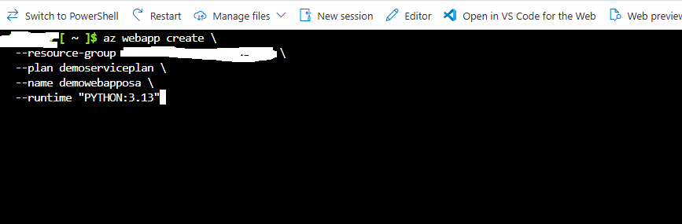
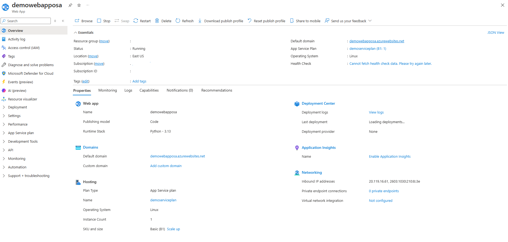
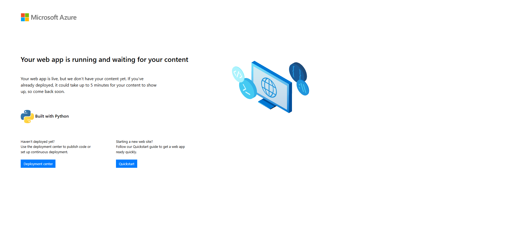

# Deploying a Linux Web App via Azure CLI

Documentation covering the deployment of a dedicated Linux App Service plan, provisioning of a Python web application, resource inspection in the Azure Portal, and live endpoint verification using Azure CLI in the East US region.

---

## 1. Architecture & Provisioned Resources

All infrastructure was provisioned in the East US region under a dedicated resource group:

* App Service Plan: demoserviceplan - Linux-based hosting plan configured under the Basic (B1) tier with 1 dedicated worker instance
* Web App: demowebapposa - Azure App Service running on Linux with the Python 3.13 runtime stack
* Default Domain: demowebapposa.azurewebsites.net - Public HTTPS endpoint serving the web application

*Resource group overview confirming the provisioned App Service plan and Web App resources.*

---

## 2. Step-by-Step Implementation

### Step 1: Create Linux App Service Plan

Provisioned the underlying compute infrastructure using the Azure CLI by defining an App Service plan named demoserviceplan under the Basic B1 SKU with Linux operating system support enabled.

*Creating the Linux App Service plan with B1 pricing tier via Azure CLI.*

---

### Step 2: Provision Web App with Python Runtime

Created the web application resource named demowebapposa attached to demoserviceplan, configuring the runtime stack to Python 3.13 within the target resource group.

*Deploying the Python 3.13 web app linked to the App Service plan via Azure CLI.*

---

### Step 3: Inspect Web App Configuration in Azure Portal

Verified the deployed App Service in the Azure Portal to confirm the Running status, Linux OS environment, Python 3.13 runtime stack configuration, and assigned default domain.

*Reviewing the essentials, runtime stack, hosting tier, and domain settings in the portal.*

---

### Step 4: Verify Live Web Application

Accessed the default domain (demowebapposa.azurewebsites.net) in a web browser to verify that the application service was operational and serving the default Python landing page over HTTPS.

*Browser confirmation displaying the active Azure App Service Python interface.*

